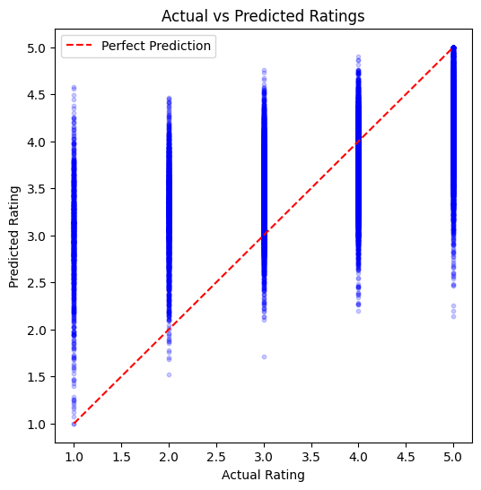
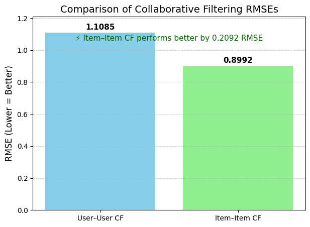

# Assignment 02: Movie Recommender Systems

This assignment implements a movie recommendation pipeline using both **content-based filtering** and **collaborative filtering**. The content-based part builds movie profiles from IMDb metadata, CMU plot summaries, and Netflix movie/rating information. The collaborative filtering part predicts ratings using user-user and item-item similarity from Netflix rating data.

## Assignment Objective

Design and implement a recommender system that suggests similar movies based on content features such as genre, director, cast, and plot summary. The assignment also asks for collaborative filtering using Netflix user-rating data.

## Datasets Used

| Dataset | Purpose in this assignment |
|---|---|
| Netflix Prize movie rating data | User, movie, rating, and timestamp information for rating prediction and RMSE evaluation |
| IMDb non-commercial datasets | Movie title, year, genre, language, directors, writers, and cast metadata |
| CMU Movie Summary Corpus | Plot summaries used for TF-IDF text features |

The final working dataframe contains **6,193 Netflix-overlapping movies** after merging and filtering.

## Methods Implemented

### 1. Content-Based Recommendation

The notebook builds a movie feature vector by combining:

- Writer one-hot vectors
- Director one-hot vectors
- Genre one-hot vectors
- Language one-hot vectors
- 500-length cast/star word vector
- 1000-length TF-IDF plot summary vector

The final feature matrix has shape:

```text
6193 movies × 12774 features
```

Cosine similarity is then used to find the top 10 most similar movies for a given title.

### 2. Collaborative Filtering

Two collaborative filtering models are implemented:

- **User-user collaborative filtering:** predicts a rating based on similar users.
- **Item-item collaborative filtering:** predicts a rating based on similar movies.

Both models are evaluated using RMSE on the Netflix probe/test ratings.

## Key Results

| Model / Method | Result |
|---|---:|
| Content-based recommender RMSE | 0.9004 |
| Item-item collaborative filtering RMSE | 0.8992 |
| User-user collaborative filtering RMSE | 1.1085 |

Item-item collaborative filtering performed best among the evaluated rating-prediction methods.

## Visual Results

### Content-Based Actual vs Predicted Ratings



### Collaborative Filtering RMSE Comparison



## Requirement Mapping

| Assignment requirement | Where it is handled in the notebook | What the code does |
|---|---|---|
| Load and clean datasets | Part 1: Data preparation | Reads IMDb, CMU, and Netflix files, normalizes titles, removes unusable rows, and prepares merge-ready tables |
| Handle missing directors or plot summaries | Part 1.8 and final dataset checks | Fills missing genre/language fields where possible and checks for remaining gaps before feature engineering |
| Merge IMDb and Netflix data | Part 1.6 and Part 1.7 | Merges IMDb+CMU metadata with Netflix titles and keeps only overlapping Netflix movie titles |
| Create unified dataframe with content features and average ratings | Part 1.10 | Adds average rating and number of ratings per movie to the merged movie metadata table |
| Convert writers to one-hot vectors | Part 2.1 and `ManualFeatureVectorizer.transform_writers()` | Creates a vector where each unique writer has one index |
| Convert directors to one-hot vectors | Part 2.2 and `ManualFeatureVectorizer.transform_directors()` | Creates one-hot vectors for directors |
| Convert genre to one-hot vectors | Part 2.3 and `ManualFeatureVectorizer.transform_genres()` | Encodes movie genres as binary features |
| Convert language to one-hot vectors | Part 2.4 and `ManualFeatureVectorizer.transform_languages()` | Encodes movie languages as binary features |
| Convert stars/cast into 500-length vector | Part 2.5 and `ManualFeatureVectorizer.transform_stars()` | Concatenates cast names, tokenizes them, and keeps the top 500 most common star-name words |
| Normalize and clean plot text | Part 2.7 and `clean_text()` | Lowercases text, removes punctuation, and removes stopwords |
| Use Zipf's law for controlled vocabulary | Part 2.7 | Uses the top 1000 most frequent words from cleaned plot summaries |
| Calculate TF-IDF matrix | Part 2.7 | Builds a 1000-length TF-IDF vector for each plot summary |
| Build the full movie feature vector | Part 2.9 | Concatenates metadata features and TF-IDF plot features |
| Compute cosine similarity | Part 3.1 | Creates a movie-to-movie cosine similarity matrix |
| Return top 10 similar movies | Part 3.2 | `get_top_similar_movies()` returns the highest-similarity movies for a given title |
| Show sample recommendations for 5 movies | Part 4.2 and Part 4.3 | Runs content-based recommendations for multiple sample movies |
| Evaluate content-based recommendation with RMSE | Part 4.4 | Compares predicted recommendation scores against Netflix probe/test ratings |
| Implement user-user collaborative filtering | Part 5.2 | Builds user similarity logic and predicts ratings from similar users |
| Implement item-item collaborative filtering | Part 5.4 | Builds movie similarity matrix and predicts ratings from similar movies |
| Evaluate collaborative filtering with RMSE | Part 5.8 and Part 5.9 | Computes RMSE for item-item and user-user collaborative filtering |

## How to Run

1. Download the datasets from their original sources.
2. Place processed files in a local `data/` folder:

```text
data/
├── imdb_cmu_netflix_verified.csv
├── netflix_ratings_filtered.csv
└── probe_filtered.csv
```

3. Install dependencies:

```bash
pip install -r ../../requirements.txt
```

4. Open the notebook:

```text
assignment-02-movie-recommender/notebooks/assignment_02_movie_recommender_system.ipynb
```

5. Update the path configuration cell if your data folder is somewhere else.

## Important Notes

- Raw datasets are not included in this repository because the Netflix, IMDb, and CMU files are large and should be downloaded from their original sources.
- Large generated files such as `.npy`, `.parquet`, `saved_models/`, and raw `.csv` files are ignored by Git.
- The notebook keeps some preprocessing blocks as commented reproducibility code because the processed intermediate files were reused during experimentation.

## What I Learned

This assignment demonstrates how content-based and collaborative filtering solve recommendation differently. Content-based filtering compares item features, while collaborative filtering learns from user-item rating behavior. In this experiment, item-item collaborative filtering produced the lowest RMSE, while the content-based model remained useful for explaining recommendations through movie metadata and plot similarity.
