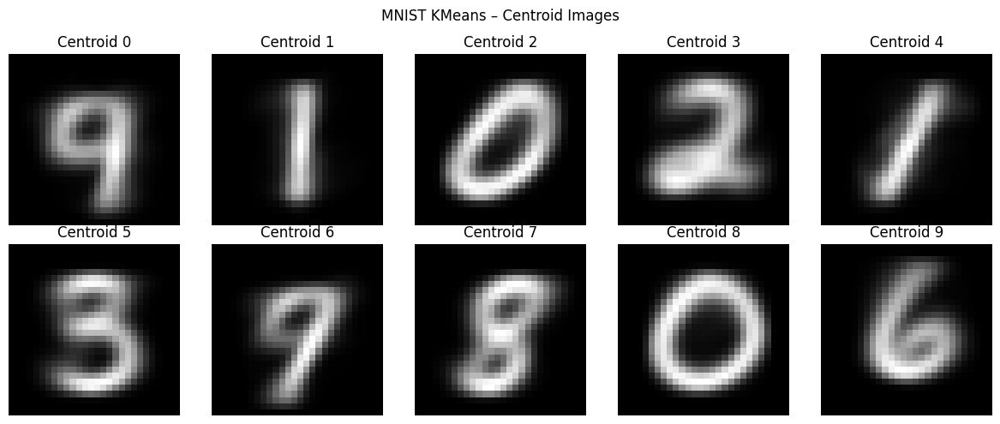

# Assignment 03: KMeans Clustering

This folder contains the cleaned notebook and documentation for Assignment 3 of the Data Mining course. The assignment focuses on implementing and evaluating KMeans clustering across tabular, image, and text data.

## What is done in this assignment

The notebook is divided into three parts.

### Part 3A: KMeans on tabular data

A custom KMeans implementation is applied to the first three numerical dimensions of the diabetes dataset. The number of clusters is set from the number of available class labels. The final clusters are visualized in a 3D interactive Plotly scatter plot where:

- marker shape represents the original class label,
- marker color represents the assigned cluster, and
- centroid markers show the final cluster centers.

The notebook also counts approximate misclustered points using the dominant-class rule inside each cluster.

### Part 3B: KMeans on MNIST image data

MNIST handwritten digit images are normalized, flattened into 784-dimensional vectors, and clustered into 10 groups using KMeans. The cluster centroids are reshaped back into 28 x 28 images for visual validation. A 3D t-SNE visualization is also generated for 1,000 sampled images, with points colored by cluster assignment.

Quantitative evaluation is performed using:

- Davies-Bouldin index,
- approximate Dunn index,
- purity, and
- Rand index.

### Part 3C: KMeans on Bangla news text

The bonus text-clustering section uses Prothom Alo news articles. The notebook selects 1,200 documents from six categories, with 200 documents per category. Text is tokenized, normalized, stemmed with a simple suffix-based stemmer, and cleaned using stopword removal. A vocabulary is built using Zipf-style frequency filtering. TF, normalized TF, IDF, and TF-IDF matrices are calculated manually rather than using library vectorizers.

The final TF-IDF vectors are clustered into six groups using KMeans. The clusters are visualized using 3D t-SNE and evaluated with the same internal and external validation metrics used for MNIST.

## Folder structure

```text
assignment-03-kmeans-clustering/
├── README.md
├── docs/
│   └── assignment_03_instruction.docx
├── notebooks/
│   └── assignment_03_kmeans_clustering.ipynb
├── outputs/
│   ├── figures/
│   │   └── q3b_mnist_centroid_images.png
│   ├── html/
│   │   ├── q3a_diabetes_kmeans_3d.html
│   │   ├── q3b_mnist_tsne_3d.html
│   │   └── q3c_prothom_alo_tsne_3d.html
│   └── logs/
│       └── results_summary.txt
└── requirements.txt
```

## Visual outputs

### MNIST centroid images



Interactive Plotly outputs are saved as HTML files under `outputs/html/`. GitHub may not render these directly, so download/open the files locally to rotate and inspect the 3D plots.

## Results snapshot

The notebook output includes the following run results. Because KMeans uses random initialization, exact values may change slightly between runs unless the same random seed is used.

| Section | Output | Value |
|---|---:|---:|
| 3A Diabetes | Approx. misclustered points | 216 / 768 |
| 3A Diabetes | Approx. clustering accuracy | 71.88% |
| 3B MNIST | Davies-Bouldin index | 2.8399 |
| 3B MNIST | Approx. Dunn index | 0.344381 |
| 3B MNIST | Purity | 0.5911 |
| 3B MNIST | Rand index | 0.8797 |
| 3C Text | Selected documents | 1,200 |
| 3C Text | Vocabulary size after filtering | 8,075 |
| 3C Text | Davies-Bouldin index | 2.1077 |
| 3C Text | Approx. Dunn index | 0.209303 |
| 3C Text | Purity | 0.1742 |
| 3C Text | Rand index | 0.1826 |

## Requirement mapping

### Part 3A: Custom KMeans on tabular data

| Assignment requirement | Where it is done in the notebook | Explanation |
|---|---|---|
| Use first three dimensions of the dataset | `main_3A()` and `load_and_preprocess_diabetes()` | Loads the diabetes dataset and slices the first three feature columns for clustering. |
| Use `K` equal to the number of classes | `main_3A()` | `K` is calculated from the number of unique class labels. |
| Randomly initialize centroids from data points | `initialize_centroids_simple()` | Selects `K` random rows from the dataset as the initial centroids. |
| Calculate cluster affiliation by distance | `kmeans()` | For every data point, Euclidean distance to each centroid is calculated and the nearest centroid is assigned. |
| Count number of points per cluster | `kmeans()` | `cluster_point_count` stores how many points are assigned to each cluster. |
| Recompute centroids | `kmeans()` | Each centroid is recalculated as the mean of all points assigned to that cluster. |
| Use objective-function termination | `calculate_objective()` and `kmeans()` | The algorithm stops when the change in `J` becomes smaller than the tolerance threshold. |
| Plot 3D clusters with shape and color logic | `visualize_clusters_3d()` | Shape comes from ground-truth class label; color comes from cluster affiliation. |
| Count wrongly clustered points | `count_misclassifications()` | Uses the dominant class inside each cluster and counts points not belonging to that dominant class. |

### Part 3B: KMeans on MNIST image data

| Assignment requirement | Where it is done in the notebook | Explanation |
|---|---|---|
| Load MNIST images | `load_mnist_data()` | Uses TensorFlow/Keras MNIST loader. |
| Flatten 28 x 28 images into 784-length vectors | `load_mnist_data()` | Reshapes images from `(60000, 28, 28)` to `(60000, 784)`. |
| Use labels only for external validation | `load_mnist_data()` and metric functions | Labels are not used during clustering, only for purity and Rand index. |
| Apply KMeans with `K = 10` | `run_kmeans_mnist()` | Runs the custom KMeans implementation with 10 clusters. |
| Show centroid images | `show_centroid_images()` | Reshapes each 784-dimensional centroid into a 28 x 28 grayscale image. |
| t-SNE 3D plot for 1,000 samples | `visualize_mnist_tsne_3d_interactive()` | Converts high-dimensional vectors into 3D coordinates for interactive visualization. |
| Internal validation | `compute_davies_bouldin_index()` and `compute_dunn_index_approx()` | Calculates DBI and an approximate Dunn index. |
| External validation | `compute_purity()` and `compute_rand_index()` | Uses true labels only after clustering to evaluate cluster quality. |

### Part 3C: Bangla text clustering

| Assignment requirement | Where it is done in the notebook | Explanation |
|---|---|---|
| Use Prothom Alo news data | `load_prothom_alo_1200()` | Loads the `.tsv` news dataset. |
| Select 1,200 news documents from six categories | `load_prothom_alo_1200()` | Selects 200 documents from each of six labels. |
| Tokenize, stem, normalize, and remove stopwords | `preprocess_text()` and `simple_stem()` | Performs basic Bangla text preprocessing. |
| Use Zipf-style vocabulary filtering | Vocabulary construction section | Removes the most and least frequent terms before building the final vocabulary. |
| Calculate TF manually | TF matrix section | Fills a document-term matrix without using a library vectorizer. |
| Calculate normalized TF manually | TF matrix section | Divides each document's term counts by its maximum term frequency. |
| Calculate IDF manually | IDF section | Computes IDF using document-frequency counts. |
| Build weighted TF-IDF matrix | TF-IDF section | Multiplies normalized TF by IDF. |
| Cluster documents into six categories | `kmeans()` call in Part 3C | Runs KMeans with `K = 6` on TF-IDF feature vectors. |
| Visualize text clusters with t-SNE | `visualize_3c_tsne_3d()` | Builds a 3D interactive Plotly visualization. |
| Evaluate clusters | 3C validation metrics section | Calculates DBI, approximate Dunn index, purity, and Rand index. |

## How to run

Install the required packages:

```bash
pip install -r requirements.txt
```

Then open the notebook:

```bash
jupyter notebook notebooks/assignment_03_kmeans_clustering.ipynb
```

Recommended environment: Google Colab or Kaggle Notebook. MNIST and t-SNE steps can be slow on a local CPU.

## Notes for explanation later

- KMeans is unsupervised, so class labels are not used for training. Labels are only used for external validation.
- The custom KMeans loop follows the standard cycle: initialize centroids, assign each point to the nearest centroid, update centroids, calculate objective value, and stop when the objective change becomes very small.
- For 3A, visual mismatch means points with the same ground-truth shape can have different cluster colors.
- For MNIST, centroid images show what each cluster center looks like after averaging assigned digit images.
- For text clustering, TF-IDF is built manually to show the full feature engineering process instead of using `TfidfVectorizer`.
- The Dunn index implemented here is an approximation based on centroid distance and cluster radius.

## Limitations

- KMeans can converge to different results depending on initialization.
- The custom KMeans implementation is educational and less optimized than scikit-learn's implementation.
- The Bangla stemmer is simple and not a full linguistic stemmer.
- t-SNE is used only for visualization; it is not used for clustering.
